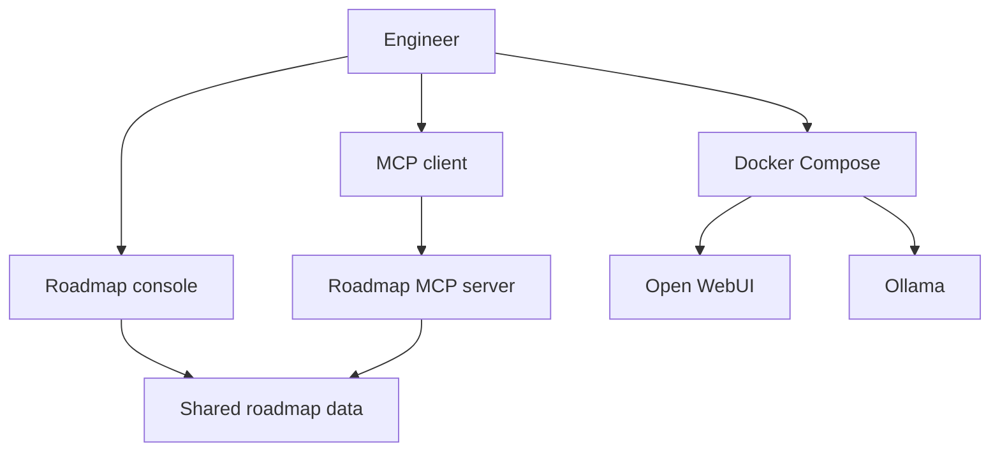
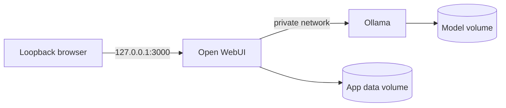
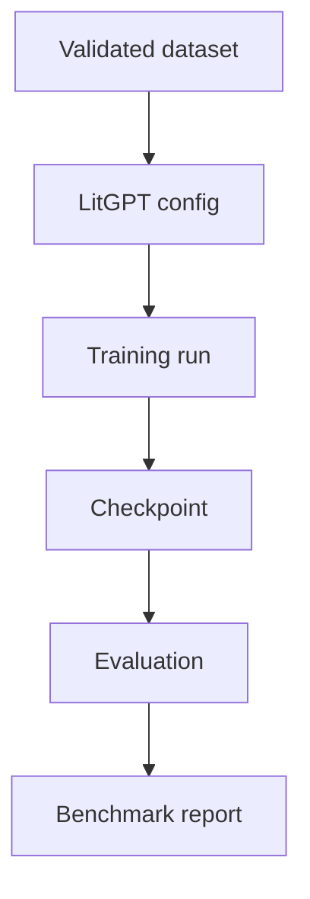
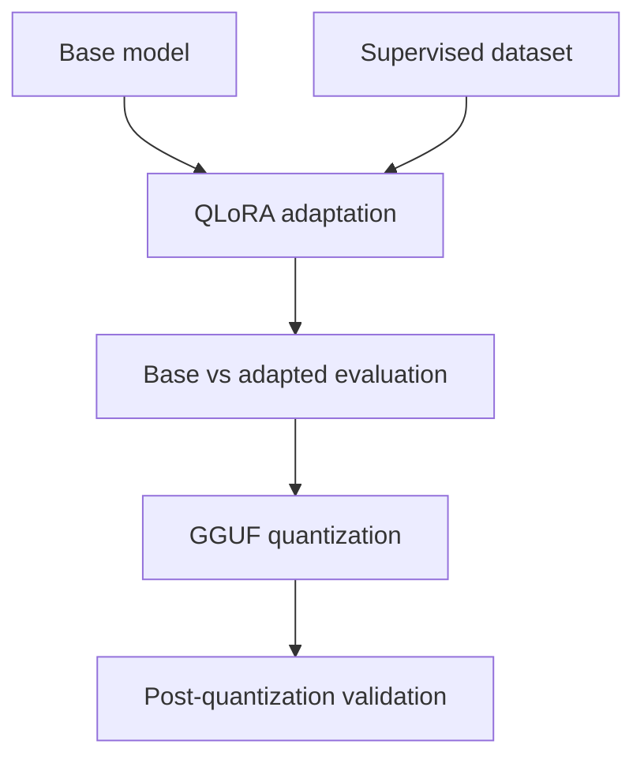
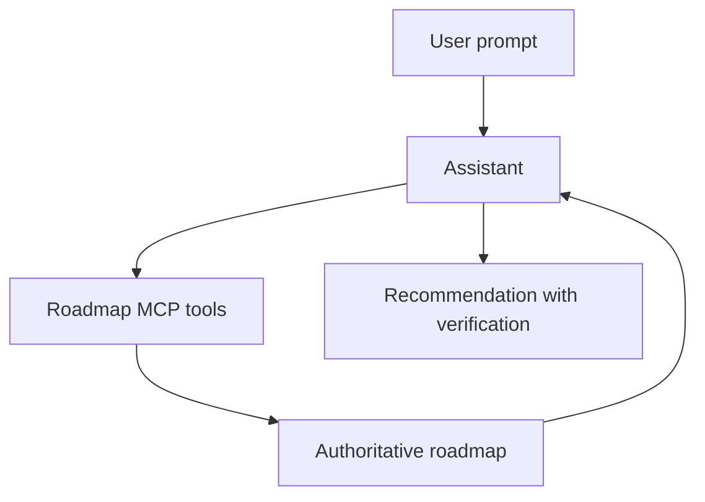
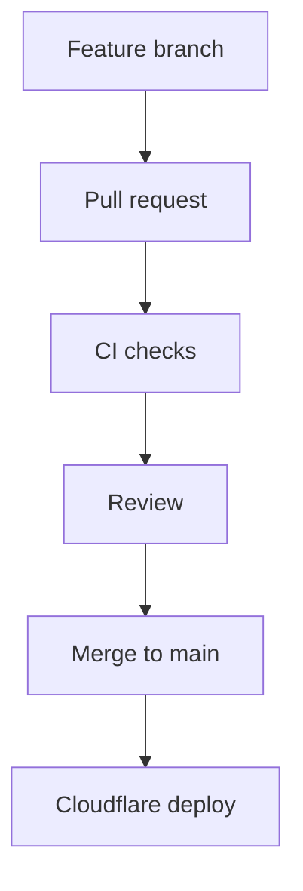

# Architecture

## Platform overview

```mermaid
flowchart TD
  U[Engineer] --> W[Roadmap console]
  U --> C[MCP client]
  C --> M[Roadmap MCP server]
  W --> R[Shared roadmap data]
  M --> R
  U --> D[Docker Compose]
  D --> O[Open WebUI]
  D --> L[Ollama]
```

## Docker Compose architecture

```mermaid
flowchart LR
  B[Loopback browser] -->|127.0.0.1:3000| W[Open WebUI]
  W -->|private network| O[Ollama]
  O --> V1[(Model volume)]
  W --> V2[(App data volume)]
```

## Training pipeline

```mermaid
flowchart TD
  D[Validated dataset] --> C[LitGPT config]
  C --> T[Training run]
  T --> K[Checkpoint]
  K --> E[Evaluation]
  E --> R[Benchmark report]
```

## Fine-tuning and QLoRA

```mermaid
flowchart TD
  B[Base model] --> Q[QLoRA adaptation]
  S[Supervised dataset] --> Q
  Q --> E[Base vs adapted evaluation]
  E --> G[GGUF quantization]
  G --> V[Post-quantization validation]
```

## Agentic workflow

```mermaid
flowchart TD
  P[User prompt] --> A[Assistant]
  A --> M[Roadmap MCP tools]
  M --> R[Authoritative roadmap]
  R --> A
  A --> X[Recommendation with verification]
```

## GitHub Actions CI/CD

```mermaid
flowchart TD
  F[Feature branch] --> P[Pull request]
  P --> C[CI checks]
  C --> R[Review]
  R --> M[Merge to main]
  M --> D[Cloudflare deploy]
```
