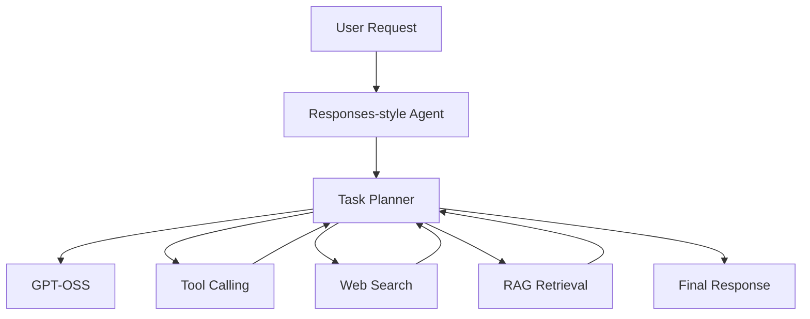

# Agent workflows

Implement Responses-style agents behind an authenticated API gateway. Treat tool schemas as allowlists, validate structured input and output, enforce per-tool timeouts, log audit metadata without prompts or secrets, and require confirmation for state-changing operations. Retrieval results must retain source identifiers so clients can render citations.

