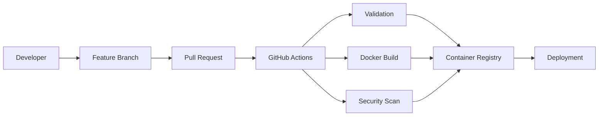

# CI/CD pipeline

Pull requests validate Markdown, workflow policy, and Compose rendering. Release and deployment workflows should be added only after a registry, staging environment, and protected environment approvals exist; deployments must use immutable image digests, health checks, and a documented rollback target.

