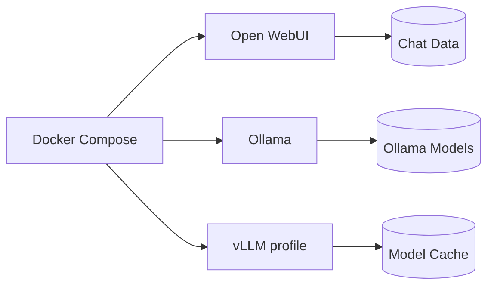

# Docker Compose architecture

`ollama-models` persists downloaded models and `open-webui-data` persists accounts, chats, knowledge bases, and application configuration. `vllm-cache` holds downloaded Hugging Face artifacts when the optional vLLM profile is enabled. Back up volumes while services are stopped for a consistent snapshot.

