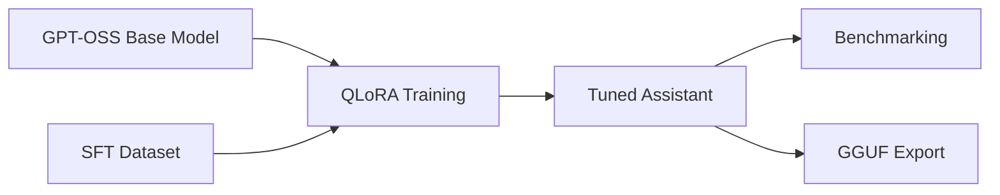

# Fine-tuning pipeline

Normalize chat and instruction JSONL into the training schema, validate licensing and remove sensitive data, then run QLoRA against a pinned GPT-OSS base model. Benchmark base and tuned models for task accuracy, quality review, latency, and GPU/CPU memory. Export only validated adapters or merged models to GGUF variants (Q4_K_M, Q5_K_M, Q6_K, Q8_0) and smoke test each artifact in Ollama.

