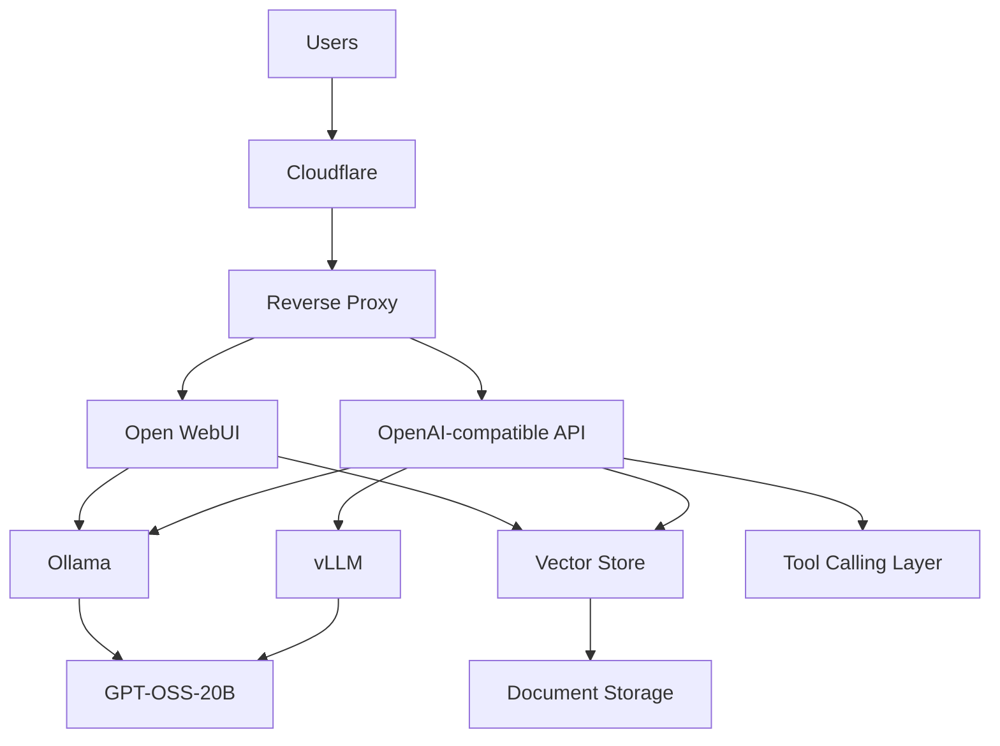

# Platform overview

The production boundary is Cloudflare followed by an HTTPS reverse proxy. Docker services bind only to loopback, so neither Open WebUI nor inference APIs are internet-facing by default. Place Caddy, Traefik, or Nginx on the same Docker network when external access is required.

Open WebUI supplies user management, role-aware administration, document ingestion, retrieval, and a browser UI. Ollama is the default local OpenAI-compatible inference service. The optional `vllm` profile is reserved for high-throughput GPT-OSS-20B serving. Keep credentials and provider tokens in a secret manager rather than Compose environment files.

