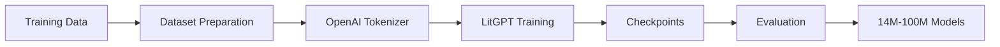

# Training pipeline

Use a separately version-pinned LitGPT environment for experimentation. Preserve raw corpus provenance, dataset manifests, tokenizer version, configuration, random seed, checkpoints, and evaluation outputs. Prepare JSONL or Parquet data, tokenize with the selected OpenAI tokenizer, then train 14M, 30M, 60M, or 100M configurations with checkpoint and resume enabled. Evaluate held-out data before promoting any checkpoint.

